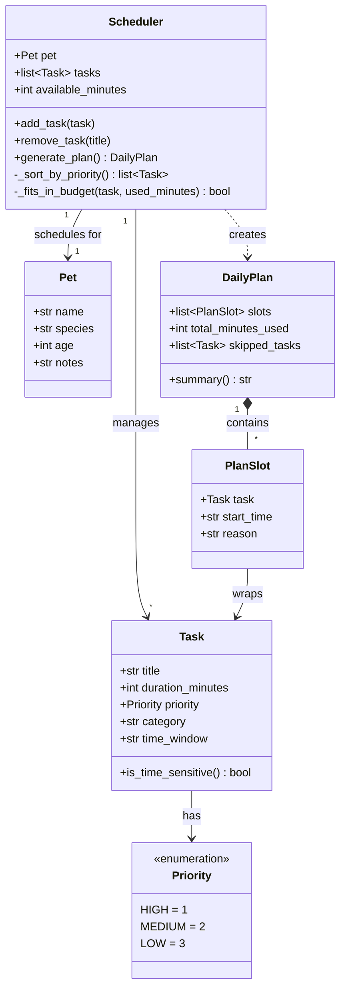

# PawPal+ UML Class Diagram

## Class Descriptions

| Class | Responsibility |
|---|---|
| `Pet` | Plain data container for owner-entered profile info (name, species, age, notes) |
| `Task` | A single care item with duration, priority, category, and optional time window; `is_time_sensitive()` flags hard window constraints |
| `Priority` | `IntEnum` with `HIGH=1`, `MEDIUM=2`, `LOW=3` so priority sorting is a plain numeric sort |
| `Scheduler` | Holds a `Pet`, task list, and available minutes; `generate_plan()` is the sole public method and returns a `DailyPlan` |
| `DailyPlan` | Output of the scheduler: ordered `PlanSlot`s, total minutes used, skipped tasks, and a `summary()` string for the UI |
| `PlanSlot` | Wraps a scheduled `Task` with its assigned start time and a human-readable reason (e.g. "High priority; scheduled first") |
