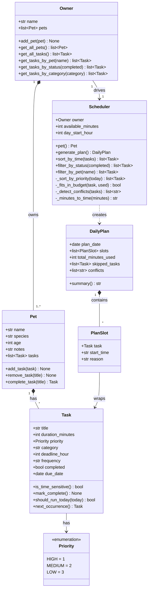

# PawPal+ — Final UML Class Diagram

## What changed from the initial UML

| Change | Reason |
|---|---|
| Added `Owner` class | Required by the assignment; `Scheduler` now takes an `Owner` instead of a bare `Pet` |
| `Task` gained `deadline_hour`, `frequency`, `completed`, `due_date` | Needed for conflict detection, recurring tasks, and schedule filtering |
| `Task` gained `mark_complete()`, `should_run_today()`, `next_occurrence()` | Recurring task logic — a task knows how to reschedule itself |
| `Pet` gained `tasks[]` and `complete_task()` | Tasks belong to pets, not the scheduler; `complete_task()` auto-appends the next occurrence |
| `Scheduler` takes `Owner`, not `Pet` | Allows scheduling across multiple pets |
| `Scheduler` gained public methods: `sort_by_time()`, `filter_by_status()`, `filter_by_pet()` | Expose sorting and filtering to the UI layer |
| `Scheduler` gained private helpers: `_detect_conflicts()`, `_minutes_to_time()` | Conflict detection and clock-time formatting |
| `DailyPlan` gained `plan_date` and `conflicts[]` | Plans need a date; conflict warnings surface to the UI |
| Removed `Scheduler → Task` (manages) relationship | Tasks no longer live on the scheduler — they live on `Pet` |
